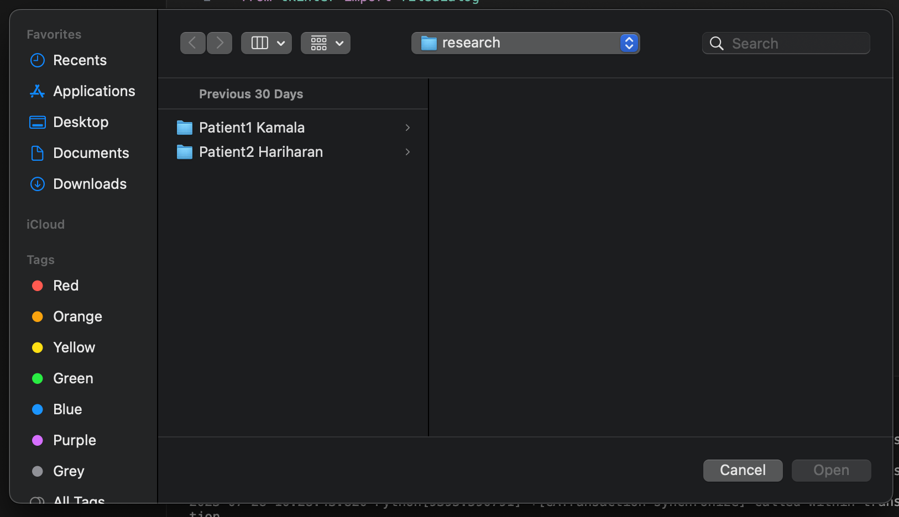
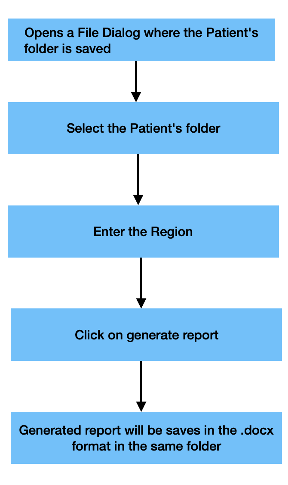

# dentalreport
## *INTRODUCTION*

CareStream 3D is a 3D imaging software used by dentists to find the anomaly in the patient's teeth. The software gives a clear 3D view of the oral bones. Based on the anamoly the software could be used in different ways. The project works for the toothless conditions.

For downloading the software please visit :👉🏻https://www.carestreamdental.com/en-in/csd-products/software/imaging-software/cs-3d-imaging-software/

NOTE : MacOS users : It is not a convenient software for MacOS, you can still give it a try.
## PURPOSE:
The project aims to perform an automation for the report generation as to try and reduce human intervention. Once the scan is done the images formed are to be processed, marked, dimensionalized and correctly  mapped to be put in the report. This part used to require a human assistance, but with the project in hand it becomes very east and error-free.
## METHOD:
 Since this is a UI based project, you might be able to see just the front part, hence here's a little description on how the project works.
  * The xml file is parsed, the dicom files are read. The necessary information is collected from these files, the slices obtained are to be windowed and put dimensions on.
  * Then the processed information and the images from scanning are templetised and put in the docx file. The docx file is still on edit mode, for further adddition of content if required.

## CODE: 
Before starting with the project ,please click this link to download all the necessary python modules in the project
PACKAGE:👉🏻

To access the code kindly download the dentalreport.py file and run using the command : python dentalreport.py

Lets look into the workflow in detail
* When we run the python file, an UI opens , which will ask for a patient's file to selected. The dialog will appear like this:
  

* Once you select the file it will ask for the region.Region is basically the area of intrest for the dentist to look and work on.Each teeth has been given a standard number called the FDI number, and with respect to the size of the teeth they are cut into different slices by the CBCT scanner. This is a very important aspect for the report generation as well.
* Once the region is also selected then you click on "Generate Report", which will create a report with the particular patient's name and the scanned images with the region of intrest automatically.This will be created in the docx format and is can also be edited further.
* Once the report is edited it can be saved in the same folder as the patient's.  

## FLOWCHART :
When you run the code, you will be able to access the following :

